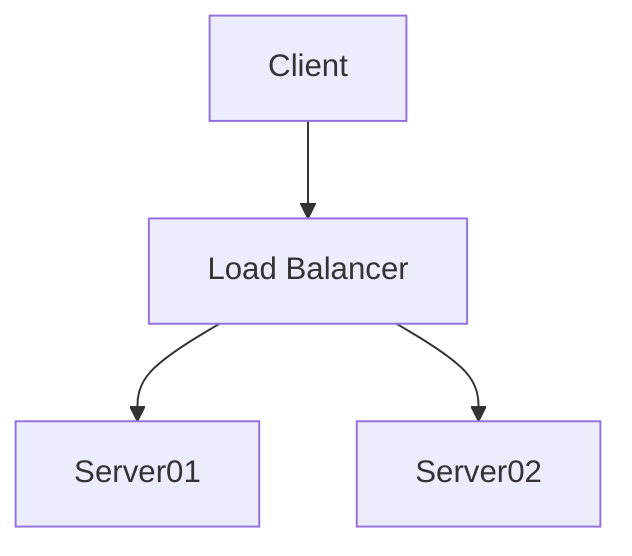

# Welcome to Forums

## Code blocks 

=== "C"

    ``` c
    #include <stdio.h> 

    int main(void) {
      printf("Hello world!\n");
      return 0;
    }
    ```

=== "C++"

    ``` c++
    #include <iostream>

    int main(void) {
      std::cout << "Hello world!" << std::endl;
      return 0;
    }
    ```

```javascript
console.log("hello world") // (1)
```

1. test here..


## Example blocks 

!!! example

    === "Unordered List"

        ``` markdown title="List, unordered"
        * Sed sagittis eleifend rutrum
        * Donec vitae suscipit est
        * Nulla tempor lobortis orci
        ```

    === "Ordered List"

        ``` markdown title="List, ordered"
        1. Sed sagittis eleifend rutrum
        2. Donec vitae suscipit est
        3. Nulla tempor lobortis orci
        ```

## Math 

$$ 
x^2 + y^2 = z^2 
$$

$$
\operatorname{ker} f=\{g\in G:f(g)=e_{H}\}{\mbox{.}}
$$

The homomorphism $f$ is injective if and only if its kernel is only the 
singleton set $e_G$, because otherwise $\exists a,b\in G$ with $a\neq b$ such 
that $f(a)=f(b)$.


``` yaml
theme:
  features:
    - content.code.annotate # (1)
```

1.  :man_raising_hand: I'm a code annotation! I can contain `code`, __formatted
    text__, images, ... basically anything that can be written in Markdown.


The HTML specification is maintained by the W3C.

--8<-- "includes/abbreviations.md"

Lorem ipsum[^1] dolor sit amet, consectetur adipiscing elit.[^2]





[^1]: Lorem ipsum dolor sit amet, consectetur adipiscing elit.
[^2]:
    Lorem ipsum dolor sit amet, consectetur adipiscing elit. Nulla et euismod
    nulla. Curabitur feugiat, tortor non consequat finibus, justo purus auctor
    massa, nec semper lorem quam in massa.
